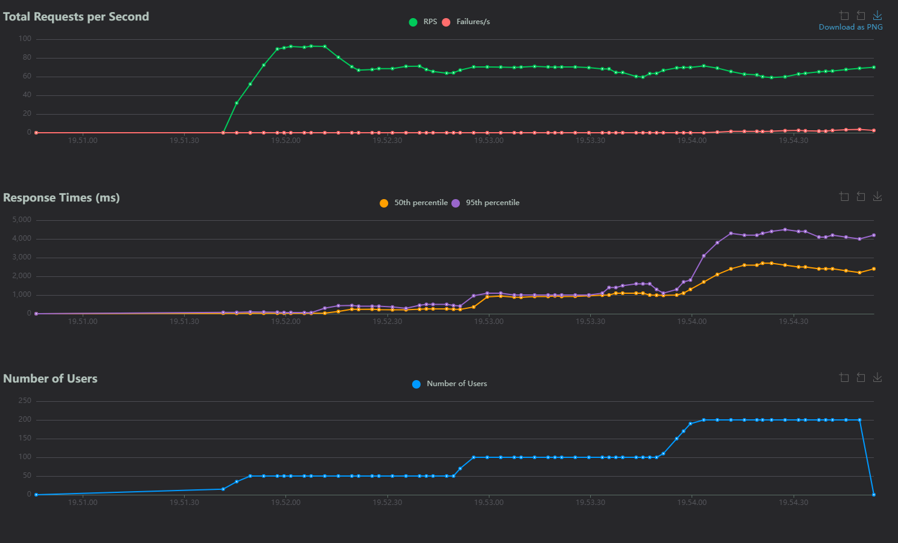

# RevoShop

A REST API backend for an e-commerce platform built with Flask and PostgreSQL. RevoShop manages products, categories, users, and orders.

## Overview

RevoShop is a REST API backend for a simple e-commerce platform. It lets you manage products, categories, users, and orders, including placing an order that contains one or more products. Data is stored in a PostgreSQL database and all interactions happen through JSON-based HTTP endpoints.

## Features Implemented

- Full CRUD for products, categories, and orders.
- Many-to-many relationship between orders and products through the `order_items` association table.
- Data validation on incoming request bodies (required fields, correct types, and value ranges).
- Error handling with `try`/`except` around database operations, returning meaningful error responses.
- Deletion guard that blocks removing a product while it is still linked to one or more active orders.

## Technologies Used

- Flask
- SQLAlchemy
- Flask-Migrate
- PostgreSQL
- pgAdmin
- pytest
- Locust
- python-dotenv

## Database Overview

RevoShop uses a PostgreSQL database (`revoshop_db`) with the following tables:

| Table | Description |
|-------|-------------|
| `users` | Registered users with username, email, password hash, role, and active status |
| `categories` | Product categories |
| `products` | Products with name, description, price, stock quantity, and category reference |
| `orders` | Customer orders with total price, status (pending/completed/cancelled), and user reference |
| `order_items` | Association table linking orders to products (many-to-many relationship) |

## ERD (Entity Relationship Diagram)


## Repository Structure

```
.
├── app.py                 # Flask application entry point and configuration
├── configuration/         # App configuration
│   └── extensions.py      # SQLAlchemy database instance
├── model/                 # Database models
│   └── models.py          # User, Product, Order, Category, order_items
├── routes/                # API route handlers (Blueprints)
│   ├── auth_route.py
│   ├── categories_route.py
│   ├── orders_route.py
│   ├── products_route.py
│   └── users_route.py
├── validation/            # Request body validators
│   ├── categories_validation.py
│   ├── orders_validation.py
│   ├── products_validation.py
│   └── users_validation.py
├── tests/                 # pytest test suite
│   ├── conftest.py
│   ├── test_categories.py
│   └── test_products.py
├── locustfile.py          # Locust load-test scenario
├── requirements.txt       # Python dependencies
├── queries.sql            # SQL queries for table creation and seed data
├── schema.sql             # PostgreSQL schema dump
├── seed.sql               # PostgreSQL data dump
├── migrations/            # Alembic database migrations
│   └── versions/          # Migration version files
├── .env.example           # Example environment variables (copy to .env)
└── .gitignore
```

## Setup / Installation

### Prerequisites

- Python 3.x
- PostgreSQL

### Steps

1. Clone the repository:
   ```bash
   git clone <repository-url>
   cd module-2-farrasahmad26
   ```

2. Create and activate a virtual environment:
   ```bash
   python -m venv venv
   # Windows
   venv\Scripts\activate
   # macOS/Linux
   source venv/bin/activate
   ```

3. Install dependencies:
   ```bash
   pip install -r requirements.txt
   ```

4. Create your environment file by copying the example, then fill in your own values:
   ```bash
   # Windows
   copy .env.example .env
   # macOS/Linux
   cp .env.example .env
   ```
   Then edit `.env` and set your actual `DATABASE_URL` (and `FLASK_DEBUG` if needed).

5. Create the PostgreSQL database:
   ```sql
   CREATE DATABASE revoshop_db;
   ```

6. Set up the schema and seed data using the SQL files:
   ```bash
   psql -U postgres -d revoshop_db -f schema.sql
   psql -U postgres -d revoshop_db -f seed.sql
   ```

   Or run the migrations:
   ```bash
   flask db upgrade
   ```

7. Run the application:
   ```bash
   flask run
   ```

   The server will start at `http://localhost:5000`.

## Deployment

The API is deployed on Render and available at:

**[https://module-2-farrasahmad26.onrender.com](https://module-2-farrasahmad26.onrender.com)**

> Note: On Render's free tier the service may take a few seconds to spin up on the first request after being idle.

## API Endpoints

Postman documentation URL:
```
https://documenter.getpostman.com/view/57322437/2sBYApzD2K
```

| Method | Endpoint | Description |
|--------|----------|-------------|
| GET | `/products` | Get all products |
| POST | `/products` | Create a new product |
| GET | `/products/<id>` | Get a product by ID |
| PUT | `/products/<id>` | Update a product |
| DELETE | `/products/<id>` | Soft-delete a product (blocked if used in active orders) |
| PUT | `/products/restore/<id>` | Restore a soft-deleted product |
| GET | `/categories` | Get all categories |
| POST | `/categories` | Create a new category |
| GET | `/categories/<id>` | Get a category by ID |
| PUT | `/categories/<id>` | Update a category |
| DELETE | `/categories/<id>` | Soft-delete a category |
| PUT | `/categories/restore/<id>` | Restore a soft-deleted category |
| GET | `/orders` | Get all orders |
| POST | `/orders` | Create a new order |
| GET | `/orders/<id>` | Get an order by ID |
| PUT | `/orders/<id>` | Update an order |
| DELETE | `/orders/<id>` | Soft-delete an order |
| GET | `/users` | Get all users |
| POST | `/users` | Create a new user |
| GET | `/users/<id>` | Get a user by ID |
| PUT | `/users/<id>` | Update a user |
| DELETE | `/users/<id>` | Soft-delete a user |
| PUT | `/users/restore/<id>` | Restore a soft-deleted user |
| POST | `/login` | Authenticate a user with email and password |

## Screenshots

### pytest (test results)


### Locust (load test dashboard)

